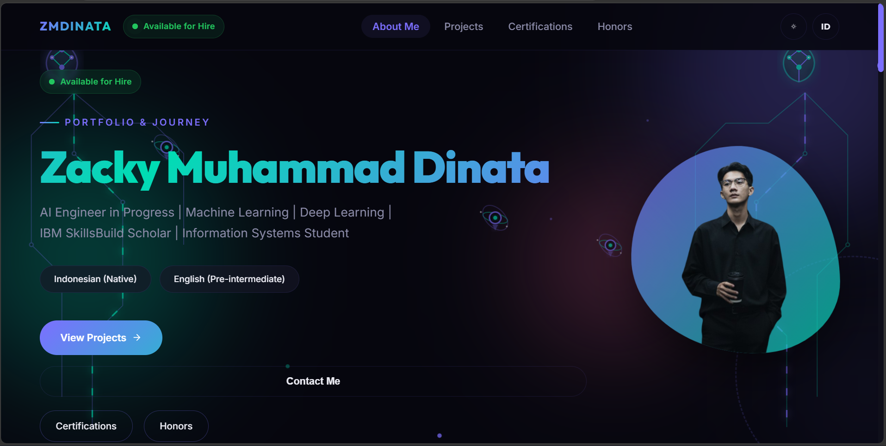

# ZMDINATA | Personal Portfolio & Journey

Sebuah website portofolio modern yang dibangun dengan fokus pada estetika premium, performa tinggi, dan kemudahan manajemen konten melalui Admin Panel yang terintegrasi dengan Supabase. Website ini menggabungkan kecanggihan database cloud dengan keamanan data lokal.



## ✨ Fitur Utama

- **🚀 Hybrid Data Architecture**: Menggunakan sistem **Auto-Fallback & Merge** yang menggabungkan data dari Supabase (cloud) dan file lokal secara otomatis. Data lama tidak akan hilang saat Anda menambah data baru di Admin Panel.
- **🛠️ Responsive Admin Panel**: Dashboard khusus yang kini mendukung tampilan mobile penuh untuk mengelola Profil, Pengalaman, Pendidikan, Proyek, Sertifikat, dan Penghargaan di mana saja.
- **🤖 AI Core Hero Animation**: Latar belakang Hero section yang futuristik dengan animasi SVG "AI Core Drones" dan "Neural Brain" yang responsif dan mendukung mode gelap/terang.
- **🌍 Multilingual Support**: Dukungan penuh dua bahasa (Bahasa Indonesia & Inggris) yang terintegrasi di seluruh bagian website.
- **✨ Premium UI/UX**: 
  - Efek **3D Tilt** interaktif pada kartu proyek dan sertifikat.
  - Navigasi responsif dengan *hamburger menu* yang presisi.
  - Transisi halus menggunakan **Framer Motion**.
- **📄 Native PDF Preview**: Penampil sertifikat dan dokumen PDF yang stabil dan cepat di perangkat mobile maupun desktop.

## 🛠️ Teknologi yang Digunakan

- **Core**: [React.js](https://reactjs.org/) + [Vite](https://vitejs.dev/)
- **Backend**: [Supabase](https://supabase.com/) (PostgreSQL & Authentication)
- **Styling**: Vanilla CSS (Custom Glassmorphism Design System)
- **Animations**: [Framer Motion](https://www.framer.com/motion/) & SVG Keyframes
- **Icons**: [React Icons](https://react-icons.github.io/react-icons/)
- **Deployment**: [Vercel](https://vercel.com/)

## 📦 Struktur Proyek

- `/src/pages`: Halaman utama dan halaman manajemen admin.
- `/src/components`: Komponen UI reusable (Modal, Card, Navbar, dll).
- `/src/lib`: Konfigurasi library eksternal (Supabase client).
- `/src/data`: File statis sebagai fallback data keamanan.
- `/src/styles`: Sistem desain modular berbasis CSS.

## 🚀 Memulai (Setup)

1. **Clone & Install**:
   ```bash
   git clone https://github.com/zmdinata/MyPortfolio.git
   cd MyPortfolio
   npm install
   ```

2. **Environment Variables**:
   Buat file `.env` di root folder:
   ```env
   VITE_SUPABASE_URL=link_proyek_supabase_anda
   VITE_SUPABASE_ANON_KEY=kunci_anon_supabase_anda
   ```

3. **Database Schema**:
   Jalankan script SQL yang tersedia di folder `artifacts` (jika ada) pada SQL Editor Supabase untuk membuat tabel yang diperlukan.

4. **Development**:
   ```bash
   npm run dev
   ```

## 📄 Lisensi

Proyek ini dibuat untuk penggunaan pribadi sebagai portofolio profesional.

---
Dikembangkan dengan ❤️ oleh **Zacky Muhammad Dinata**
